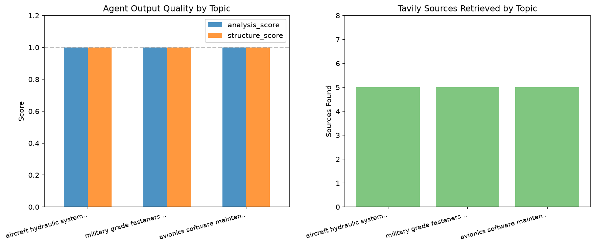

# Procurement Research Agent
### Multi-Agent AI System

A multi-agent AI system for defense procurement research built with LangGraph, LangChain, Ollama, and Tavily. Given a procurement topic, three specialized agents collaborate to search for market data, analyze findings, and draft a structured recommendation.

## Overview

Defense industry companies build and support complicated products ranging from protective equipment to aircraft platforms. These products are made of both commercially available and custom-made items. Making good sourcing decisions for these parts requires extensive research. Aggregating information on suppliers, pricing trends, market conditions, and possible risks requires significant man-hours when performed manually.

This system lets you ask plain English questions and get well researched reports from quality online sources. Every response provides a procurement recommendation, executive summary, market assessment, cost considerations, risks and mitigations, recommended next steps, and potential information gaps.

**Example queries:**
- *"aircraft hydraulic system components suppliers"*
- *"military grade fasteners and hardware pricing"*
- *"avionics software maintenance contracts defense"*

## Key Design Decisions

**Three Agents**  
This system has a research, analysis, and recommendation agent. More complex agentic systems have more performing various jobs such as orchestration, evaluator, and domain expert. I chose a simple linear chain for the purposes of demonstrating a portfolio project.

**Tavily**  
Tavily Search API has a free-tier online research agent that can be used for supplier information, pricing trends, and market data. 

**max_results=5**  
Balance Tavily search coverage vs. context length.

**Ollama/Mistral**  
Fully local inference. Defense procurement is a regulated and sensitive business. Information on the makings of military equipment should not be sent to external APIs. Mistral 7B provides strong instruction following at a size that runs on consumer hardware.

## Evaluation

An evaluation dataset of 3 topics was used for a multi-topic test. Each query was checked for number of sources, analysis quality, and structure quality. The analysis score measures whether the Analysis Agent addressed all five required areas: suppliers, pricing, market conditions, risks, and data gaps. The structure score measures whether the Recommendation Agent produced all six required sections: Executive Summary, Market Assessment, Cost Considerations, Risks and Mitigations, Recommended Next Steps, and Information Gaps.

| Metric | Score |
|---|---|
| Avg sources per query | 5.0 |
| Avg analysis score | 100% |
| Avg structure score | 100% |

**Key finding:**  
Structure scores indicate how well prompt templates are designed and if the agents consistently follow instructions. Analysis scores reflect how well Tavily works as a research agent. These are imperfect metrics. Content quality and reasoning depth are not covered. A production system would use a separate LLM to evaluate the outputs.



*Structure, analysis, and source scores. This is a simple system that performed well on simple metrics.*

## Stack

| Component | Technology |
|---|---|
| Orchestration | LangGraph |
| LLM | Ollama / Mistral 7B |
| Research Agent | Tavily Search API |
| Notebook | Jupyter / VS Code |

## Agentic Pipeline

```text
Defense procurement query
        │
        ▼
┌─────────────────────┐
│   Research Agent    │  Tavily Search API. Outputs formatted results.
└─────────┬───────────┘  
          │
          ▼
┌─────────────────────┐
│   Analysis Agent    │  Ollama/Mistral7B
└─────────┬───────────┘  Analyzes Research Agent results as a defense 
          │              procurement analyst.
          |              
          ▼
┌─────────────────────┐
│  Recommendation     │  Ollama/Mistral7B
│       Agent         │  Performs as a senior defense procurement advisor.
└─────────┬───────────┘  Drafts structured report based on Analysis Agent's
          │              findings.
          ▼
   Structured procurement report
```

## Setup

### Prerequisites
- Python 3.10+
- [Ollama](https://ollama.ai) installed and running
- [Tavily API key](https://tavily.com) (free tier)

### Installation

```bash
git clone https://github.com/DarrellS0352/procurement-research-agent.git
cd procurement-research-agent

python -m venv venv
venv\Scripts\activate        # Windows
pip install -r requirements.txt
```

### Environment Variables
Create a `.env` file in the project root: 
```TAVILY_API_KEY=your_key_here```

### LLM Setup
```bash
ollama pull mistral
ollama serve
```

### Run
Open `Procurement_Agent.ipynb` in VS Code or Jupyter and run cells sequentially.

## Potential Improvements
- **LLM-as-judge**: use a separate LLM to grade outputs on a rubric for relevance, accuracy, and completeness.
- **Reflection pattern**: add a Critic Agent that scores the recommendation and loops back to regenerate if quality is below a threshold
- **Planner Agent**: add an orchestrator that dynamically decides what to search for rather than using a hardcoded query template
- **Conditional routing**: if Tavily returns fewer than 3 results, route to a fallback search strategy instead of proceeding with thin data
- **Memory**: persist prior research sessions so the agent can reference previous procurement topics without re-searching


## Background

Built as a portfolio project demonstrating GenAI/LLM engineering skills with direct domain relevance. Five years of military aviation logistics analytics on H-1 Helicopter and V-22 Osprey programs at Bell Textron provided firsthand exposure to the complexity of defense supply chains and the manual research burden procurement decisions require.

## License
MIT
